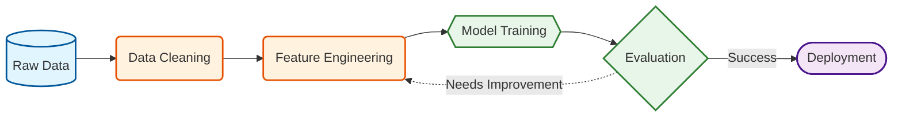
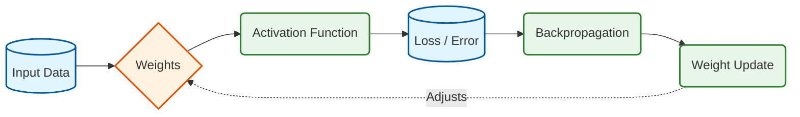
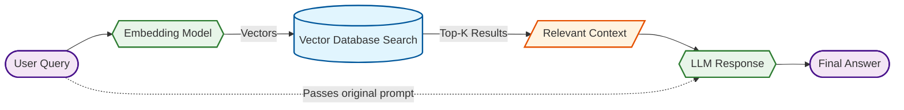

# AI / ML Engineer Roadmap (High Salary Focus)

This roadmap is for becoming a serious AI/ML Engineer — not a tutorial watcher.

---

# 1. Strong Foundations (Non-Negotiable)

## 1.1 Mathematics

You must understand:

- Linear Algebra (vectors, matrices)
- Probability
- Statistics
- Basic Calculus (derivatives, gradients)

Goal:
Understand how models learn — not just how to use libraries.

---

## 1.2 Python Mastery

You must know:

- Numpy
- Pandas
- Matplotlib
- OOP (Object Oriented Programming)
- Writing clean modular code

Avoid messy notebooks.
Write structured Python scripts.

---

## 1.3 Data Structures & Algorithms (DSA)

Without this, high salary roles are closed.

Focus on:
- Arrays
- Strings
- Recursion
- Trees
- Graphs
- Dynamic Programming

Goal:
Solve Medium problems confidently.

---

# 2. Core Machine Learning

Understand how ML actually works.

## Topics:

- Supervised Learning
- Regression
- Classification
- Decision Trees
- Random Forest
- Support Vector Machine (SVM)
- Gradient Boosting
- Bias vs Variance
- Cross Validation

Do not just call `.fit()`.
Implement at least one algorithm from scratch.

---

## ML Workflow Diagram

Understand this entire pipeline.

---

# 3. Deep Learning

Now move to Neural Networks.

## Learn:

- Neural Networks basics
- Backpropagation
- Convolutional Neural Networks (CNN)
- Recurrent Neural Networks (RNN)
- Long Short-Term Memory (LSTM)
- Transformers
- Attention Mechanism

Use:
- PyTorch (preferred)

---

## Neural Network Flow

If you don't understand this clearly, go back.

---

# 4. Specialization (High Demand Track)

Choose ONE main focus.

## Recommended: LLM + AI Systems

Learn:

- Transformers deeply
- Large Language Models (LLMs)
- Fine-tuning models
- Retrieval-Augmented Generation (RAG)
- Vector Databases
- API building (FastAPI)
- Docker
- Cloud Deployment (AWS / GCP)

---

## LLM Architecture (Simplified)

Understand this fully.

---

# 5. Production Skills (Very Important)

Many can build models.
Few can deploy them.

Learn:

- REST APIs
- Docker
- CI/CD
- Model Monitoring
- Cloud Hosting
- Scalability basics

Goal:
Think like an engineer, not a student.

---

# 6. Build Serious Projects

Avoid small tutorial projects.

Build:

- Full LLM-based assistant with RAG
- Deployed ML API
- Real-world dataset project
- End-to-end system (Data → Model → Deployment)

Your GitHub must show depth.

---

# 7. System Design for ML

Understand:

- How to reduce model latency
- How to scale inference
- How to handle large data
- How to optimize cost

High salary roles require this thinking.

---

# 8. Interview Preparation

Prepare for:

- DSA rounds
- ML theory questions
- ML system design
- Real-world case problems

Example:
- How to detect fraud?
- How to handle imbalanced dataset?
- How to deploy model for 1M users?

---

# 9. Continuous Growth

To reach elite level:

- Read research papers
- Contribute to open source
- Participate in hackathons
- Write technical blogs
- Build AI SaaS products

---

# Final Mindset

Do not:

- Jump between domains
- Copy projects blindly
- Ignore math
- Avoid DSA

Do:

- Go deep
- Build real systems
- Think in terms of scale
- Focus on impact

---

# End Goal

Become someone who can:

- Design models
- Improve models
- Deploy models
- Scale models
- Optimize systems

That is what high salary companies pay for.

Tried out git commands
2nd try - without --set-upstream/-u